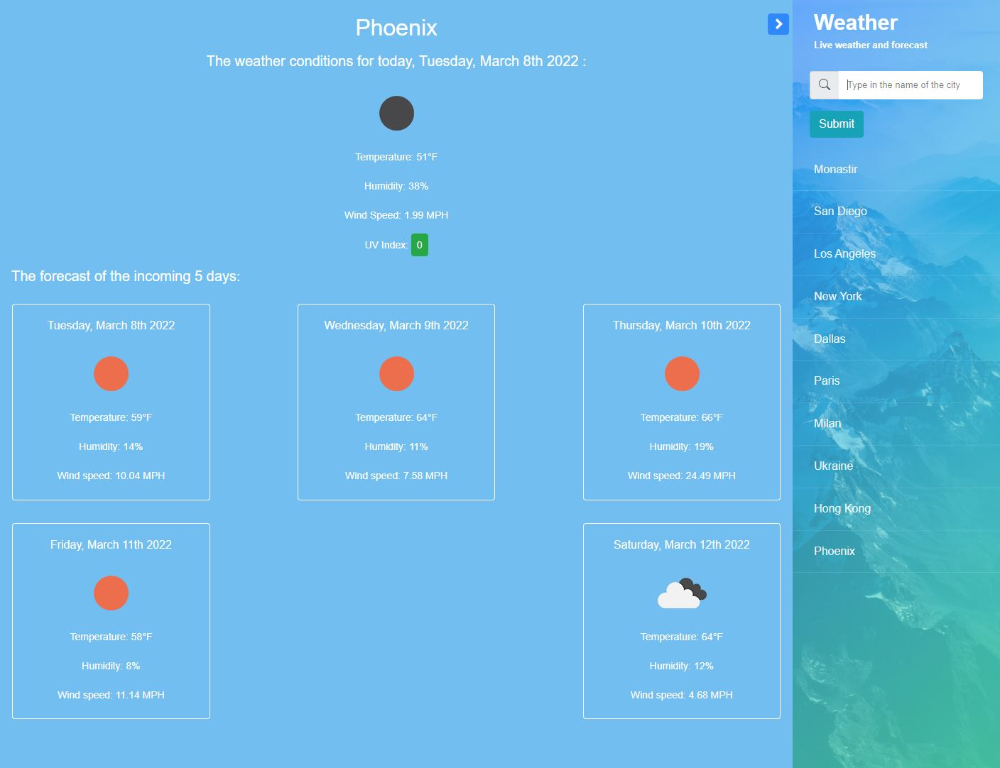

# The weather dashboard
A web application to check the weather and forecast by entering the name of the city.
## Languages
_HTML_, _CSS_, *jQuery*
## Libraries
_Moment.js_, _Bootstrap_, _OpenWeather API_
## Screenshots

## Link to the online application
[Click here](https://hlachaal.github.io/weather-dashboard/)
